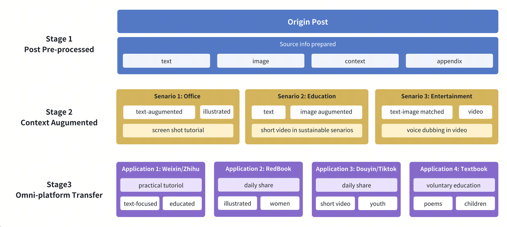
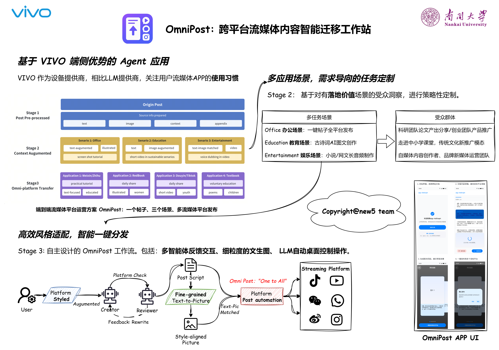
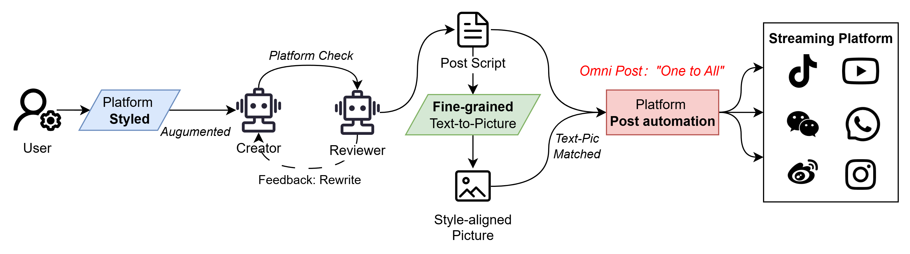

# OmniPost

OmniPost 是一款跨平台流媒体内容智能迁移工作站，极大提升内容创作者与团队的流媒体平台运营效率。

<!-- 使用 HTML 标签插入图片并控制大小 -->
<!-- 方法1：使用 width 和 height 属性 -->
<!--  -->
<!-- 方法4：响应式图片，在不同屏幕尺寸下自适应 -->


从一个创作思路出发，自动化内容图文增强，面向平台进行风格适配与发布。将原始创作思路（如视频、短文、配图等）进行

- 基于平台风格的高定制度适配和优化、
- 细粒度图文补充生成与内容格式匹配、
- LLM 自动化桌面控制并行发布至不同平台



据我们所知，OmniPost 是首个面向跨平台流媒体内容智能迁移这一场景的端到端解决方案。

## Poster



## Requirements

- python 3.11(less than 3.10 may not support MCP from Anthropic)
- crewai(latest)
- langchain(latest)
- stable diffusion
- browser use(latest)



## How to run

```structure
OmniPost
├─aigc-AdGraph-front // Andriod APP UI
├─part1_graph_generate // 多智能体交互生成内容
├─part2_textSpilt_graphGenrate // 细粒度文生图
├─part3_browser_use // LLM自动化桌面控制
└─other...
```

### 环境准备

**Python 环境**

- Python 3.11 (推荐，低于 3.10 可能不支持 Anthropic 的 MCP)
- 建议使用虚拟环境

**基础依赖安装**

```powershell
# 创建虚拟环境
python -m venv venv
# 激活虚拟环境
.\venv\Scripts\Activate.ps1
```

### 模块运行指南

#### 1. part1_graph_generate - 多智能体交互生成内容

**功能**: 使用 CrewAI 框架实现多智能体协作，生成内容创作的指导文档

**依赖安装**:

```powershell
cd part1_graph_generate\demo\adgraph_flow
pip install uv
pip install crewai[tools]
# 或使用
crewai install
```

**配置**:

- 在 `.env` 文件中添加 `OPENAI_API_KEY`
- 修改 `src/adgraph_flow/config/agents.yaml` 定义智能体
- 修改 `src/adgraph_flow/config/tasks.yaml` 定义任务

**运行**:

```powershell
cd part1_graph_generate\demo\adgraph_flow
crewai run
# 绘制工作流图
crewai flow plot
```

**输出**: 在根目录生成 `report.md` 文件

#### 2. part2_textSpilt_graphGenerate - 细粒度文生图

**功能**: 小说文本分析、角色提取、场景分镜、提示词生成和图像生成的完整流水线

**依赖安装**:

```powershell
cd part2_textSpilt_graphGenerate
pip install -r requirements.txt
```

**配置**:

- 配置 `novel_trans_image_API/config.yaml` 文件
- 设置各厂商 API 密钥 (Google Gemini、智谱 AI、DeepSeek 等)
- 配置代理设置 (如需要)

**运行方式**:

**方式 1: 直接运行主程序**

```powershell
cd part2_textSpilt_graphGenerate
python main.py
```

**方式 2: 使用 API 服务**

```powershell
cd part2_textSpilt_graphGenerate\novel_trans_image_API
python Scene_Excrat.py
# 或
uvicorn Scene_Excrat:app --host 0.0.0.0 --port 8000 --reload
```

**API 文档**: 访问 `http://localhost:8000/docs`

**主要功能**:

- 角色提取: `/extract_characters_from_file`
- 场景分镜: `/generate_scene_storyboard`
- 提示词生成: `/generate_scene_prompt`
- 图像生成: `/generate_image`

#### 3. part3_browser_use - LLM 自动化桌面控制

**功能**: 使用 Playwright 进行浏览器自动化操作

**依赖安装**:

```powershell
cd part3_browser_use
pip install playwright
# 安装浏览器驱动
playwright install
```

**运行**:

```powershell
cd part3_browser_use
python weihua_playwright.py
# 或
python playwright_2.py
```

**功能**: 自动化网页截图、内容抓取等操作

#### 4. aigc-AdGraph-front - Android APP UI

**功能**: Android 移动端用户界面

**环境要求**:

- Android Studio
- JDK 8+
- Android SDK

**运行**:

```powershell
cd aigc-AdGraph-front
# Windows
.\gradlew.bat build
# 或在Android Studio中直接运行
```

### 完整工作流程

1. **内容创作指导** → 运行 `part1_graph_generate`
2. **文本处理** → 运行 `part2_textSpilt_graphGenerate` 进行角色提取和场景分析
3. **图像生成** → 使用 `part2` 的 API 生成对应图像
4. **自动化发布** → 使用 `part3_browser_use` 自动化发布到各平台
5. **移动端展示** → 使用 `aigc-AdGraph-front` 进行移动端展示

### 注意事项

- 确保所有 API 密钥正确配置
- 网络代理设置 (如在国内使用 Google Gemini)
- Stable Diffusion 服务需要单独部署
- 各模块可以独立运行，也可以组合使用

详细参考各模块内部的 readme.md 文件

## Copyright

邝伟华\*(weihua.kwong@mail.nankai.edu.cn)、王璞、沈超、李群、钱程
